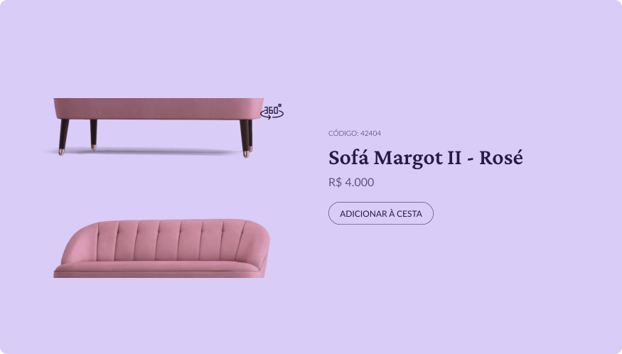

<h1 align="center"> Store </h1>

 Card de produto 

<h3 align="center"><a href="https://jairo-sousa.github.io/boracodar-2-store/" >Clique para visitar o projeto</a></h3>

## Projeto

Desafio semanal [#boracodar](https://boracodar.dev/) proposto pela [rocketseat](https://www.rocketseat.com.br/)

#02 - um Card de produto

## Layout

Você pode visualizar o layout do projeto através [DESSE LINK](https://www.figma.com/community/file/1195050984449538256). É necessário ter conta no [FIGMA](https://www.figma.com/) para editá-lo.

---

Feito por <a href="https://github.com/jairo-sousa/" >Jairo Sousa</a>
